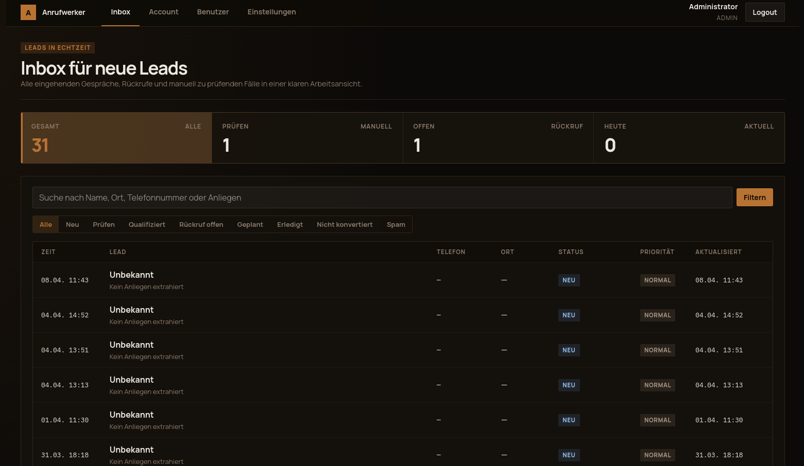

# anrufwerker

AI-powered phone answering system for small businesses — tradespeople, medical practices, service providers.

Answers calls, recognises caller intent, responds in real time, and queues tasks for follow-up. Runs entirely locally — no cloud required.



---

## What the stack does

```
Caller → Asterisk → SIP-Bridge → Whisper (STT) → Ollama (LLM) → Piper (TTS) → Caller
                                       ↓
                                 Async-Worker
                                 (extraction, queue)
                                       ↓
                                 Dashboard (admin UI)
```

- **STT:** [whisper.cpp](https://github.com/ggerganov/whisper.cpp) via HTTP (Vulkan/ROCm/CUDA)
- **LLM:** [Ollama](https://ollama.com) on the host (no container needed)
- **TTS:** [Piper](https://github.com/rhasspy/piper) (local, ONNX) or edge-tts (Microsoft Azure Neural, online)
- **Telephony:** Asterisk with the AudioSocket protocol

---

## SIP / PBX requirements

anrufwerker only needs **Asterisk ARI + AudioSocket**. The SIP source does not matter.

Tested and known to work:

| Source | Notes |
|--------|-------|
| **Fritz!Box** (AVM) | Common in Germany; use as SIP registrar in Asterisk |
| **Sipgate, IONOS, Telekom SIP-Trunk** | Standard SIP trunks, configure as PJSIP endpoint |
| **Twilio, Vonage / Nexmo** | Cloud SIP trunks, use SIP termination URI |
| **Grandstream ATA / other ATA** | Connects analogue PSTN lines to SIP |
| **3CX, FreePBX, other PBX** | Integrate anrufwerker as a SIP peer or ARI app |
| **Direct SIP provider** | Any provider that delivers calls to Asterisk works |

If you are already running Asterisk (or another PBX that can forward calls to Asterisk ARI), anrufwerker plugs in without changes.

---

## Prerequisites

- Docker & Docker Compose
- Ollama on the host (`http://127.0.0.1:11434`)
- Asterisk (local or as a container with `--profile standalone`)
- Whisper model: `ggml-large-v3-turbo.bin` (or a smaller variant)
- GPU recommended for Whisper (ROCm / Vulkan / CUDA)

---

## Quickstart

```bash
# 1. Clone the repository
git clone git@github.com:dida-80b/anrufwerker.git
cd anrufwerker

# 2. Configure the environment
cp .env.example .env
# Edit .env: Asterisk credentials, Ollama model, Piper voice

# 3. Pull the LLM model on the host
ollama pull ministral-3:14b-instruct-2512-q8_0

# 4. Download Piper voices (example: Thorsten German)
mkdir -p data/piper-voices
wget -P data/piper-voices \
  https://huggingface.co/rhasspy/piper-voices/resolve/main/de/de_DE/thorsten/high/de_DE-thorsten-high.onnx \
  https://huggingface.co/rhasspy/piper-voices/resolve/main/de/de_DE/thorsten/high/de_DE-thorsten-high.onnx.json

# 5. Start the stack
docker compose up -d

# 6. Check health
curl http://localhost:8083/health   # Dashboard
```

### With bundled Asterisk + Whisper (standalone)

```bash
docker compose --profile standalone up -d
```

---

## Services & Ports

| Service | Port | Description |
|---------|------|-------------|
| `sip-bridge` | 5003 / AudioSocket 9093 | Asterisk AudioSocket + TTS/STT/LLM |
| `piper` | 5150 | Piper TTS HTTP service |
| `async-worker` | 8087 | Job queue processor |
| `dashboard` | 8083 | Admin UI |
| `whisper-gpu` | 8091 | Whisper STT (profile: `standalone`) |
| `asterisk` | 5060/8088 | PBX (profile: `standalone`) |

---

## Configuration

### TTS engine

Default is Piper (local, no internet):

```env
TTS_ENGINE=piper
PIPER_VOICE=de_DE-thorsten-high
PIPER_URL=http://127.0.0.1:5150
```

Alternative: edge-tts (Microsoft Azure Neural, requires internet):

```env
TTS_ENGINE=edge
TTS_VOICE=de-DE-SeraphinaMultilingualNeural
```

### Key variables

| Variable | Description | Default |
|----------|-------------|---------|
| `TTS_ENGINE` | TTS engine (`piper` or `edge`) | `piper` |
| `PIPER_VOICE` | Piper voice | `de_DE-thorsten-high` |
| `OLLAMA_URL` | Ollama address | `http://host.docker.internal:11434/api/chat` |
| `OLLAMA_MODEL` | LLM model | `ministral-3:14b-instruct-2512-q8_0` |
| `WHISPER_URL` | Whisper HTTP endpoint | `http://127.0.0.1:8090` |
| `STT_ENGINE` | STT engine | `whisper-http` |
| `INBOUND_ENABLED` | Enable inbound calls | `true` |

Full reference: `.env.example`

### Company configuration

Business details (name, services, opening hours, etc.) are managed in the admin dashboard under **Settings → Company Data** — no JSON file required.

---

## Admin Dashboard

Available at `http://localhost:8083`

Default login:
- Email: `admin@anrufwerker.local`
- Password: `anrufwerker-start`

Change immediately after first login under **Account → Password**.

---

## Piper voices (German)

Recommended German voices:

| Voice | Quality | Size |
|-------|---------|------|
| `de_DE-thorsten-high` | High | ~109 MB |
| `de_DE-thorsten_emotional-medium` | Medium | ~74 MB |
| `de_DE-kerstin-low` | Low (fast) | ~61 MB |
| `de_DE-ramona-low` | Low (fast) | ~61 MB |

All Piper voices: [rhasspy/piper-voices](https://huggingface.co/rhasspy/piper-voices)

English voices are also available — swap the voice and update the system prompt for English calls.

---

## Monitoring (optional)

```bash
docker compose --profile monitoring up -d
```

- Prometheus: `http://localhost:9092`
- Grafana: `http://localhost:3001` (default password: `admin`)

---

## Privacy

- Call data is stored locally in `data/transcripts/`
- No data is sent to external services (unless `TTS_ENGINE=edge`)
- `data/transcripts/` and databases are excluded from `.gitignore`

---

## License

AGPL-3.0
